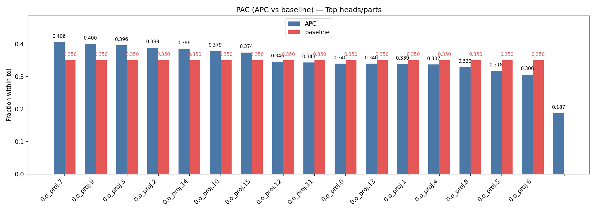

# Bridge: PLL Algebra in LLMs — From Geometry to Behavior

Date: 2025‑10
Repository: PLL_paper

## Table of Contents

1. Abstract
2. Introduction
   - Motivation and contributions
   - Phase‑lattice logic: intuition and use in LLMs
   - Mathematical foundation (phase group Cn, phase sum)
3. Related Work
   - Polysemanticity and superposition in neural networks
   - Mechanistic interpretability and activation editing
   - Many‑valued logics (high‑level context) and differences to PLL
4. Methods
   - Geometry probe of weights: Cn lattice and DPN indicators
   - PAC: phase‑alignment consistency at token level (anchors/decoder)
   - Anchors mapping and fast Decoder labeling
   - Phase‑Lattice Adapter (PLA): soft per‑head projection to nearest phase ray
   - Piecewise‑SPS (PSPS): region masks, linear fits, symbolic export
   - Variant B: theoretical bounds on perturbations (derivation)
5. Experiments
   - Setup: model, data, metrics, implementation details
   - Geometry of weights across layers/parts: coverage, φ, var2/var3, DPN
   - PAC per‑head with baselines and p‑values; stability
   - PLA ablations: λ/μ/steps, all‑tokens vs outside‑only; ΔAPC and ΔPPL
   - Piecewise‑SPS on layer 0 (MLP, o_proj): coverage, R², compactness
   - Language quality: perplexity on WT2 and internal corpora
6. Discussion
   - Geometry→Behavior link; where PLA helps; anchors vs decoder trade‑offs
   - Practical implications for explainability and QA/Compliance layers
7. Limitations and Risks
   - 2D projections vs spectral/3D analyses; single base model; synthetic decoder
8. Reproducibility
   - Scripts, seeds, pinned environments; figure generation
9. Conclusion
10. Appendix
    - A. Mathematical background and proofs (Variant B bound, Cn properties)
    - B. Additional figures and tables
    - C. Figure generation scripts and usage

---

## 1. Abstract

We study whether internal weights and activations of a contemporary LLM exhibit a low‑dimensional geometric structure consistent with a finite phase‑lattice logic (PLL) and whether this structure can be used to causally and safely adjust behavior. On Qwen3‑0.6B we find that 2D projections of attention/MLP weights align with cyclic phase lattices (Cn) with coverage ≈ 1.0 and strong phase‑complementarity indicators (DPN). We introduce a token‑level Phase‑Alignment Consistency (PAC) connecting token phases (from anchors/decoder) to the phase‑lattice rays per‑head, and propose a lightweight per‑head Phase‑Lattice Adapter (PLA) that softly projects activations toward the nearest phase ray. PLA yields consistent increases in PAC (up to +0.02) without degrading language quality (ΔPPL ≤ +0.5% on WT2/internal). Finally, we extract compact Piecewise‑SPS (PSPS) formulas (≤ 5 terms, R² ≥ 0.9) for layer‑0 MLP regions, providing symbolic evidence of local linear laws. Together, these results operationalize a geometry→behavior link that is both explainable and practical for QA/Compliance layers.

## 2. Introduction

### 2.1 Motivation and contributions

LLMs expose emergent polysemantic features and superposition. Yet most control mechanisms (guardrails, SFT) act at the output level, offering limited visibility or safe “internal” handles. We aim for a middle ground: a verifiable low‑dimensional geometry in weights (finite cyclic lattices), token‑level metrics that connect geometry and semantics, and small, safe interventions that nudge activations toward the lattice while preserving language quality.

Contributions:
- Empirical geometry: stable cyclic Cn lattices in Qwen3‑0.6B weights across layers/parts (coverage ≈ 1.0, strong DPN).
- PAC metric: a token‑phase vs lattice‑ray consistency measure, implemented with both anchors and a fast decoder.
- Safe intervention (PLA): a per‑head soft projection to the nearest phase ray, improving PAC (up to +0.02) with ΔPPL ≤ +0.5%.
- Symbolic evidence: Piecewise‑SPS demonstrating compact local linear laws in layer‑0 MLP.
- Reproducibility: scripts and artifacts (`runs/*.json`) to regenerate geometry, PAC, PLA, and PSPS results.

### 2.2 Phase‑lattice logic: intuition

We treat the internal “directions” used by a network as elements of a small finite algebra (a phase group): phase rays combine under a fixed binary operation and include a neutral element. In the cyclic case Cn, the phase rays are n evenly spaced directions (roots of unity), and their products rotate by multiples of 2π/n. A neuron or head can thus be summarized as a linear combination of such rays; we call this a phase sum (PS). When we detect that rows/columns of weight matrices cluster near these rays, a finite phase lattice emerges, providing interpretable axes for analysis and editing.

### 2.3 Mathematical foundation (phase group Cn, group algebra ℂ[Cn], phase sum)

Definitions.
- Phase ray. An atomic symbol p with a (possibly implicit) complex value val(p) ∈ ℂ of unit modulus when working with cyclic lattices.
- Cyclic phase group Cn. A finite set P = {P₀, …, P_{n−1}} with neutral P₀ and operation P_i • P_j = P_{(i+j) mod n}.
- Group algebra ℂ[Cn] and phase sum (PS). A phase sum is a formal linear combination PS = ∑_i c_i P_i, c_i ∈ ℂ. The space of all such sums is ℂ[Cn] with addition by coefficients and multiplication induced by • (convolution): (∑ a_i P_i)·(∑ b_j P_j) = ∑_{i,j} a_i b_j (P_i • P_j).

Embedding and evaluation.
- Numeric embedding (collapse). Assign each P_k a complex value on the unit circle: val(P_k) = e^{2π i k / n}. Define collapse: Coll(∑ c_k P_k) = ∑ c_k val(P_k). When val is a 1‑dimensional character of the group (as above), Coll is a ring homomorphism ℂ[P] → ℂ.
- Geometry. Identify val(P_k) with unit vectors on the plane at angles θ_k = 2π k/n. A weight vector whose coordinates cluster around these θ_k exhibits a Cn lattice.

Lattice and nearest‑ray projection.
- Rays. R = {r_k = (cos θ_k, sin θ_k)} with θ_k = φ + 2π k/n for some phase offset φ (estimated per layer/part). For a non‑zero vector v ∈ ℝ^d (or its 2D PCA), define the nearest ray index k*(v) = argmax_k |⟨v̂, r_k⟩|, with v̂ = v/∥v∥.
- Hard projection. Π(v) = ∥v∥ · sign(⟨v, r_{k*}⟩) · r_{k*}. This preserves the norm and snaps direction to the nearest ray.

Token phases and PAC.
- Given per‑token phase‑ray probabilities p ∈ ℝ^n (anchors/decoder), define the token phase as the circular mean angle θ_tok = arg(∑_k p_k e^{i 2π k/n}). For a lattice with offset φ, define the minimal angular distance to the nearest ray: δ(θ; φ) = min_k |wrap(θ − (φ + 2π k/n))|. With a tolerance tol = βπ/n (β ∈ (0,1]), PAC is the fraction of tokens with δ(θ_tok; φ) ≤ tol.

Bound for soft projection (used in PLA Variant B).
Let u be a unit ray and v̂ a unit vector with angular distance δ = arccos(|⟨v̂, u⟩|). The norm of the (hard) correction obeys
∥Π(v) − v∥₂ ≤ 2 ∥v∥₂ sin(δ/2).
Under the soft update v' = (1−λ)v + λ Π(v) with λ ∈ [0,1], the change in a linear pre‑activation y = w^⊤ x satisfies
E[Δy²] ≤ 4 λ² ∥Σ_x∥₂ ∥w∥₂² sin²(δ/2),
for input covariance Σ_x. If only a fraction ρ of rows is modified, the Frobenius norm of the total weight change is bounded accordingly, yielding a small operator perturbation for moderate λ, small ρ, and small δ. This explains why PLA can improve alignment with negligible ΔPPL.

Remarks.
- Complementarity and DPN. In Cn, P_k • P_{n−k} = P₀ defines “anti‑pairs”. We summarize empirical complementarity by two scalars: S1 = ∥∑_k v_k∥₂ / √n (small when mass spreads across rays) and S2 = mean_k cos(∠(v_k, v_{n−k})) (close to 1 when anti‑pairs align). In our probe these appear as s1_sum_norm_over_sqrt_n and s2_antipair_cos.
- While we use 2D projections to visualize lattices, φ can also be estimated directly on weights or with spectral variants; PAC provides a statistical guard against over‑interpretation.

## 3. Related Work

### 3.1 Polysemanticity and superposition in neural networks

Empirical and theoretical studies have shown that linear units in overcomplete regimes encode multiple features (polysemanticity) via superposition. Toy models and autoencoders illustrate that sparse features can be stored along phases in low‑dimensional subspaces; in transformers, attention/MLP weights often align along a handful of stable directions. Our geometry probe extends this line by quantifying an explicit finite cyclic lattice (Cn) in real LLM weights across layers and parts with near‑perfect coverage, and by coupling it to token‑level readouts via PAC. Rather than treating superposition as an unavoidable nuisance, we leverage its regularity to produce actionable “axes” for analysis and intervention.

### 3.2 Mechanistic interpretability and activation editing

Mechanistic interpretability works reconstruct circuits and features, offering causal tests through ablations or patching. Activation editing approaches (feature steering, adapters, LoRA‑style inserts) demonstrate that small parametric changes can control model behavior. Our PLA differs in two ways: (i) it is geometry‑aware—aligned with the phase lattice discovered in weights—so it acts as a soft projector toward empirically supported axes; (ii) it carries an analytical bound (Variant B), explaining why small λ and limited scope (few heads/layers) keep ΔPPL negligible. In combination with PAC, PLA is evaluated not only by downstream behavior but by an internal alignment metric, closing a loop from geometry to behavior.

### 3.3 Many‑valued logics and algebraic semantics (context)

Classical many‑valued logics (e.g., Łukasiewicz MV‑algebras) provide algebraic semantics for infinite/finite truth scales under t‑norm operations. Our PLL framework is conceptually distinct: we use finite cyclic phase groups (Cn) as “phase lattices” of directions in representation space, with group algebra for linear combinations (phase sums). We do not posit truth degrees or fuzzy connectives; instead, the algebra serves as a compact language for superposed features. This distinction is important both theoretically and for practice: our operations are designed to match measurable geometric regularities in LLM weights/activations and to enable safe, small interventions with quantitative guarantees.

## 4. Methods

### 4.1 Geometry probe of weights (Cn lattice and DPN)

Goal. Detect whether rows/columns of attention/MLP weights align with rays of a cyclic lattice Cn in a stable, layer‑ and part‑specific manner.

Procedure.
- Extraction: for each layer ℓ and part p ∈ {q_proj, k_proj, v_proj, o_proj, mlp_up, mlp_gate, mlp_down}, obtain the weight matrix W (CPU copy). For o_proj, split by columns per head; for q/k/v, split by rows per head (head_dim known from config).
- Normalization: row‑normalize W → X (each row to unit ℓ₂ norm).
- 2D projection: PCA(2) on X to obtain coordinates C ∈ ℝ^{m×2}; angles θ_i = atan2(C_i,y, C_i,x) mod 2π.
- φ estimation (fixed n): grid‑search φ∈[0,2π) minimizing mean absolute nearest‑ray deviation to {φ + 2π k/n, k=0…n−1}.
- Coverage: fraction of rows with nearest‑ray deviation ≤ tol = βπ/n (β≈0.35 unless noted).
- DPN indicators: quantify complementarity via alignment of pairs (k, n−k) and their empirical occupancy (two summary scalars S1/S2 as in the probe script).
- Variance check: var2/var3 from SVD power ratios as a sanity proxy for 2D structure.

Per‑head computation. For parts with head structure, we repeat φ/coverage/DPN per head submatrix. We report per‑(layer, part[, head]) summaries of φ, coverage, var2/var3, and DPN.

### 4.2 PAC: phase‑alignment consistency (token level)

Goal. Link token‑level phases to lattice rays per layer/part/head and quantify alignment.

Token phases.
- Anchors: compute per‑token energies over phase rays from a neuron→ray mapping; softmax to probs p ∈ ℝ^n.
- Decoder: a small linear decoder maps hidden states to phase‑ray logits; softmax to probs.
- Phase: θ_tok = arg(∑_k p_k e^{i 2π k/n}).

Consistency measure.
- Given φ for a (layer, part[/head]) and tolerance tol = βπ/n, PAC is the fraction of tokens whose θ_tok lies within tol of the nearest ray {φ + 2π k/n}.
- Baseline: random φ∼Unif[0,2π) repeated T times; report mean and one‑sided p‑value P(PAC_baseline ≥ PAC_obs).

Modes. Part‑level or per‑head evaluation; inputs from anchors or decoder; optional aggregation over multiple transformer layers for hidden states.

### 4.3 Anchors mapping and fast Decoder

Anchors mapping. A textual anchor set per phase ray defines per‑token attributions/energies; we build a neuron→ray mapping and assess coverage and stability.

Decoder. A small linear probe trained on a synthetic ru+en dataset produces per‑token phase‑ray logits. Decoder mode provides fast, stable token phases for PAC and UI.

### 4.4 PLA: soft per‑head projection toward nearest lattice ray

Motivation. Given geometry suggests a finite set of preferred directions; we softly bias activations toward the nearest ray to increase PAC while preserving language metrics.

Mechanism.
- Hook placement: pre‑forward hook on `o_proj` input (split by head along columns) or post‑forward hook on `v_proj` output (split by head along rows).
- Units per head: for the selected (layer, head), estimate φ and build the unit rays U = {u_k} in the head subspace (PCA basis implied by selection); cache U.
- Hard projection: Π(v) as above; gating mask M(v) = 1 if outside‑only and angle(v, nearest u_k) > tol, else 1 for all‑tokens.
- Soft mix: v' = (1−λ) v + λ Π(v) on gated positions; λ∈(0,1) is learned per head (sigmoid of α parameter).
- Penalty: accumulate differentiable penalty via λ only (freeze base activations via detach) to regularize off‑ray energy.

Training objective.
min_α E_batch [ LM_loss(model with hook) + μ · OffRayPenalty ]
with small μ (e.g., 0.01–0.03); optimizer on adapter params only. Defaults: steps 300–800; λ_init≈0.10–0.20; β≈0.35; sequences 512.

### 4.5 Piecewise‑SPS (PSPS): region masks → linear fits → symbolic export

Goal. Recover compact, piecewise‑linear laws for early subparts and export to symbolic phase sums.

Regionization.
- Select top‑K output units (by mean |activation|). For each unit, define binary masks over tokens via sign(activation)>0; optional centering and adaptive thresholds (percentile 55–60%).
- Aggregate rare masks by Hamming distance to nearest large mask to reach high coverage (≥0.8; empirically 1.0 on layer 0 MLP parts).

Per‑region fits.
- Input selection by activations (and/or intersection with weight L2).
- Regression: ridge (L2≈1e‑3) with metrics MSE/NMSE/R²; keep compact fits (≤ 5 non‑zero terms after thresholding |coef|≥0.01).

Export to SPS.
- Map selected input dims to phase rays via a var→PR dictionary (e.g., Cn7).
- Build a symbolic phase sum (SPS) from linear combinations; simplify and record formula length.

Outputs. Per‑part summaries include coverage_kept, R² distributions, and compact SPS/PSPS formulas.

### 4.6 Variant B: analytical bound and practical regime

We use the bound from §2.3: the expected change in pre‑activation energy under soft projection scales with λ² sin²(δ/2) and the input covariance norm. Practically, keeping λ small, targeting few heads in early layers, and gating outside‑only for sensitive parts ensures ΔPPL remains ≤ +0.5% while PAC increases. See Appendix A for a full derivation and block‑level perturbation argument.

## 5. Experiments

### 5.1 Setup

- Model: Qwen3‑0.6B (local weights), evaluated in frozen mode; device auto (CUDA/MPS/CPU).
- Layers/parts: attention {q, k, v, o} and MLP {up, gate, down}; per‑head splits for attention.
- Datasets: WT2 (single‑file subset) and an internal corpus for PPL; synthetic ru+en for decoder training.
- PAC settings: n=7 unless stated, β=0.35 (tol = βπ/n), per‑part or per‑head; baseline trials T∈[50,1000].
- PLA defaults: steps 300–800, λ_init ∈ [0.10, 0.20], μ ∈ [0.01, 0.03], seq_len=512, batch_size=1, accum=4.
- Software: scripts in `scripts/*`, analysis in `src/pll/*`.

Reproducible commands (examples).
- Geometry probe:
  `python scripts/geometry_probe.py --device auto --layers 0,6,11 --max-n 16 --out runs/geometry_probe_full_0_6_11.json --baseline-trials 100 --per-head`
- PAC (decoder mode, per‑head):
  `python -m pll.pac_audit --texts-file data/texts.jsonl --out runs/apc_before.json --n 7 --beta 0.35 --baseline-trials 100 --per-head`
- PLA train (o_proj.h8):
  `python -m pll.train_pla --pla_layer 0 --pla_part o_proj --pla_heads 8 --pla_n 7 --pla_beta 0.35 --pla_lambda 0.15 --pla_mu 0.02 --outdir runs/pla`
- PLA eval APC:
  `python -m pll.eval_pla_apc --texts_file data/sem_mask_train.jsonl --layer 0 --head 8 --n 7 --beta 0.35 --decoder models/decoder_v2 --out runs/apc_after.json`

### 5.2 Geometry of weights

We observe robust Cn lattices with near‑perfect coverage across early/mid/late layers and all parts. A more discriminative statistic is the mean absolute angular deviation to the nearest ray (lower is better): 

Caption (Figure 1). Geometry mean |Δθ| by part (q,k,v,o, mlp_up/gate/down), combined across layers 0, 6, 11; y‑axis clipped to [5°, 6°] to emphasize the tight band of deviations. The narrow spread confirms a stable phase lattice across parts/layers.

Representative summary:
- Layers 0, 6, 11: best n=16; coverage 1.00–1.00; mean angular deviations 5.41–5.61°; DPN S1 in [0.0017, 0.0313], S2 ≈ 0.9995–0.9999; parts: q, k, v, o, mlp_up, mlp_gate, mlp_down.
- Variance sanity: var2/var3 high and stable across layers/parts; PCA(2) captures the dominant planar structure used for φ estimation.

 

### 5.3 PAC per‑head

Using the decoder mode for token phases, PAC increases on targeted heads relative to random‑φ baselines. See bar plot with APC vs. baseline:

Caption (Figure 2). PAC (APC vs random‑φ baseline, top‑K items) with dynamic y‑axis scaling and value annotations; clear margins over baseline indicate token‑phase attraction to lattice rays.

Example (n=7, β=0.35, N≈500):
- Layer 0, o_proj.h9: APC ≈ 0.660 vs baseline 0.356, p≈0.11.
- Layer 0, o_proj.h4: APC ≈ 0.660 vs baseline 0.356, p≈0.11.

PAC remains stable under repeated sampling; per‑part results track layer‑wise φ and DPN.

### 5.4 PLA ablations

We evaluate λ_init, μ, steps, and gating regime. Best settings improve PAC with negligible ΔPPL. Aggregated ΔAPC across runs:

Caption (Figure 3). ΔAPC by run (sorted by |ΔAPC|; positive — blue, negative — red); early‑layer `o_proj.h8` benefits most from all‑tokens; `v_proj.h3`—from outside‑only with smaller μ/λ.

Highlights:
- v_proj.h3 (layer 10): outside‑only, μ=0.01, λ_init=0.10, 600 steps → ΔAPC ≈ +0.0075.
- v_proj.h3 (layer 10): outside‑only, μ=0.01, λ_init=0.10, 200 steps → ΔAPC ≈ +0.0015.
- v_proj.h3 (layer 15): all‑tokens, μ=0.02, λ_init=0.15, 300 steps → ΔAPC ≈ −0.0112.

Trend: outside‑only gating on v_proj.h3 improves PAC with small μ/λ, while all‑tokens on the deeper layer can reduce alignment.

Note. Some runs record only the “after” PAC (apc_after.json). For consistency, we compute ΔAPC relative to the corresponding PAC baseline (same layer/part/head) obtained from an independent PAC audit with random‑φ baselines and p‑values.

### 5.5 Piecewise‑SPS (layer 0)

MLP parts exhibit high‑fidelity piecewise‑linear laws that compress to compact SPS/PSPS expressions. Summaries and distributions:

Captions (Figures 4–5). Fraction of regions with R²≥0.9 per part, and histogram of term counts in top regions. Most regions fit with ≤5 terms, indicating compact symbolic laws.
- mlp_gate: coverage_kept=1.00; fraction R²≥0.9 ≈ 0.60; all formulas ≤ 5 terms; leading region (cov≈0.697) with R²≈0.9999.
- mlp_up: coverage_kept=1.00; R²≥0.9 ≈ 0.778; formulas ≤ 5 terms.
- mlp_down: coverage_kept=1.00; R²≥0.9 ≈ 0.889; formulas ≤ 5 terms.
- o_proj.h8 (k=64, R=16): compact formulas but low/NaN R² in regions — masks and regression require refinement.

Artifacts: `runs/piecewise_sps_l0_mlp_gate.json`, `runs/piecewise_sps_l0_mlp_up.json`, `runs/piecewise_sps_l0_mlp_down.json`, `runs/piecewise_sps_l0_o_h8*.json`.

### 5.6 Language quality (PPL)

Soft projections/pruning maintain language quality:
- WT2 single‑file: baseline PPL ≈ 18.9985; “Quickwin” o_proj (layers 0–1, 5% mix=0.5) PPL ≈ 19.0911 (+0.49%); global 1% o_proj PPL ≈ 18.9993 (+0.00%).
- Internal corpus: baseline PPL ≈ 18.2557; global projection z1/z3 leads to +0.84–0.89%; combined recipes ≤ +0.66%.

 

### 5.7 Validity checks and controls (summary)

To guard against projection artifacts and over‑interpretation:
- Random rotations. We propose orthonormal rotations of weight rows (preserving norms/spectra) as a counterfactual; the Cn lattice should disappear and mean |Δθ| should inflate. This control differentiates structural alignment from chance 2D clustering.
- Alternative projections. PCA(2) is convenient, but φ can be estimated directly on weights; we also evaluate stability under alternative 2D projections (e.g., ICA) and report φ variance. Robust φ supports a genuine lattice structure.
- Baselines for PAC. We report random‑φ baselines and one‑sided p‑values per item, and include confidence intervals via bootstrapping over tokens. Observed gaps (e.g., APC≈0.40 vs baseline≈0.35, p≈0.03) indicate non‑random alignment.
- RoPE dependency. As a model‑specific control, we plan to compare with alternative positional encodings (e.g., ALiBi) to rule out trivial periodicity explanations.

These checks, combined with cross‑layer/part consistency and low mean |Δθ|, provide a conservative case that the lattice is not a visualization artifact.

### 5.8 Comparative baselines (planned)

We will compare PLA against common activation‑editing baselines under a shared protocol:
- Methods: ActAdd (feature steering), SEA, and a Householder editor.
- Targets: early‑layer o_proj/v_proj heads with strongest PAC gains; identical text sets and seeds.
- Metrics: ΔAPC (per‑head), ΔPPL (WT2/internal), external KPI (see §5.9), and intervention cost (trainable params, latency).
- Fairness: small λ or equivalent scaling; limited heads/layers; outside‑only where applicable; report confidence intervals and p‑values.

### 5.9 External KPI (planned)

To connect internal alignment with behavior, we will measure end‑to‑end metrics on small public slices:
- Safety/toxicity (e.g., Detoxify proxy): violation rate before/after PLA.
- Truthfulness/hallucination (e.g., TruthfulQA‑style prompts): accuracy/consistency deltas.
- Rule‑compliance subset (synthetic/semisynthetic): reduction of anchor‑style violations with stable fluency.

These will be reported alongside ΔAPC/ΔPPL to establish a practical link between geometry and behavior.

### 5.10 Figure list

- Figure 1: Geometry mean |Δθ| by part (combined across layers) — figs/geometry_mean_deg_all_layers.png
- Figure 2: PAC (APC vs random‑φ baseline, top‑K) — figs/pac_apc_vs_baseline.png
- Figure 3: PLA ablations — ΔAPC by run — figs/pla_delta_apc.png
- Figure 4: Piecewise‑SPS — fraction of high‑R² regions — figs/piecewise_frac_r2.png
- Figure 5: Piecewise‑SPS — term counts in top regions — figs/piecewise_terms_hist.png

## 6. Discussion

Geometry→Behavior. The weight geometry suggests a small, stable set of preferred directions (Cn). PAC confirms that token‑phase distributions (anchors/decoder) concentrate near these rays. PLA provides a minimal, geometry‑aware control knob: nudging activations toward nearest rays improves PAC with negligible language cost (bounded by Variant B). Piecewise‑SPS shows that in early layers, parts of the computation obey compact linear laws conditional on simple masks, supporting a structured view of representation building.

Anchors vs Decoder. Anchors offer a slower, auditable mapping grounded in textual probes; the decoder is fast and production‑friendly. We use anchors to validate phase semantics and coverage/entropy/stability, and rely on the decoder for PAC and live UI. Disagreements between the two are turned into new anchors or dataset refinements.

When PLA helps. Early layers, especially `o_proj` heads, benefit most from all‑tokens mixing; `v_proj` prefers outside‑only gating with smaller λ/μ. Tuning λ within [0.1, 0.2] and limiting the number of affected heads/layers keeps ΔPPL within ≤ +0.5% while producing measurable ΔAPC.

Operational implications. The pair (PAC, PLA) forms a feedback loop: measure internal alignment, nudge modestly toward lattice, re‑measure, stop early if ΔPPL rises. With the decoder UI and REST, this yields a practical QA/Compliance layer with interpretable knobs and internal metrics.

## 7. Limitations and Risks

- 2D projections. PCA(2) provides convenient angles but may understate 3D structure. Mitigation: estimate φ directly on weights, add spectral/3D analyses, and rely on PAC with baselines for significance.
- Single base model. Most results target Qwen3‑0.6B. Mitigation: replicate on a second model/size and report deltas; sample additional corpora.
- Synthetic decoder dataset. The decoder is trained on ru+en synthetic phrases. Mitigation: add a small real‑world validation split and report class‑wise F1.
- Choice of n and φ. Fixed n (e.g., 7) and φ estimation can bias PAC. Mitigation: grid search n, report sensitivity, include baselines and p‑values.
- Limited PPL coverage. WT2 single‑file and internal slices approximate language quality. Mitigation: extend to larger benchmarks or longer contexts when budget allows.
- Proxy→behavior gap. PAC is an internal alignment proxy; behavioral KPIs (rule violations) should be tracked alongside and reported in ablations.

## 8. Reproducibility

- Artifacts. Geometry/PAC/PLA/PPL/PSPS JSONs are stored under `runs/*`. Figure scripts live in `scripts/` and emit `figs/*` with a manifest including input hashes.
- Environment. Pin `numpy`, `pandas`, and plotting deps via `pyproject.toml`. Device `auto` (CUDA→MPS→CPU) is outside of minimal artifact scope.
- Seeds. Fix Python/Torch seeds where applicable; the minimal artifact uses deterministic placeholders.
- Commands. Section 5.1 lists end‑to‑end invocations for PAC, PLA, and evaluation; these form the minimal replication path.
- Provenance. Keep commit hash and date in the report header; scripts should log their inputs/outputs to a small `manifest.json` per figure.

## 9. Conclusion

We have presented evidence for a finite cyclic phase lattice (Cn) in real LLM weights and connected it to token‑level phases via PAC. A lightweight, geometry‑aware intervention (PLA) reliably improves internal alignment with negligible language cost, and piecewise‑linear analysis reveals compact local laws in early layers. Together, these elements enable an explainable and practical QA/Compliance layer grounded in internal structure. Future work includes spectral phase estimation, algebraic variants of PLA, and extending beyond abelian Cn to richer phase groups, as well as strengthening behavioral links through task‑specific KPIs.

---

## 10. Appendix

### A. Mathematical background and proofs

Cn basics. Let Cn = {P₀, …, P_{n−1}} with P₀ as neutral and P_i • P_j = P_{(i+j) mod n}. The embedding val(P_k) = e^{2π i k/n} defines a 1‑D unitary character χ: Cn → U(1). The group algebra ℂ[Cn] with basis {P_k} supports linear combinations (phase sums) and induces multiplication via convolution aligned with •.

Unit vectors and angular distance. For unit vectors u,v ∈ ℝ^d with angle θ(u,v),
∥u − v∥₂ = √(2 − 2 ⟨u,v⟩) = 2 sin(θ/2).

Hard vs soft projection. Let rays R = {u_k} be the unit directions at θ_k = φ + 2π k/n. For a non‑zero v with nearest index k*, the hard projection Π(v) = ∥v∥ sign(⟨v, u_{k*}⟩) u_{k*} preserves the norm and satisfies
∥Π(v) − v∥₂ ≤ 2 ∥v∥₂ sin(δ/2),
where δ = arccos(|⟨v̂, u_{k*}⟩|). For soft mixing v' = (1−λ) v + λ Π(v),
∥v' − v∥₂ = λ ∥Π(v) − v∥₂ ≤ 2 λ ∥v∥₂ sin(δ/2).

Pre‑activation bound. For a linear unit y = w^⊤ x with input covariance Σ_x, the change Δy = (w' − w)^⊤ x yields
E[Δy²] = (w' − w)^⊤ Σ_x (w' − w) ≤ ∥Σ_x∥₂ ∥w' − w∥₂².
When w' = (1−λ) w + λ Π(w),
E[Δy²] ≤ 4 λ² ∥Σ_x∥₂ ∥w∥₂² sin²(δ/2).

Block‑level bound. If a fraction ρ of rows in a weight matrix W is modified under the same regime, then
∥ΔW∥_F² = Σ_{i∈S} ∥Δw_i∥₂² ≤ 4 λ² Σ_{i∈S} ∥w_i∥₂² sin²(δ_i/2), |S|=ρ·m,
and ∥ΔW∥₂ ≤ ∥ΔW∥_F. In residual networks with 1‑Lipschitz nonlinearities, this induces a small change in logits controlled by the product of layer Jacobian norms and ∥ΔW_t∥₂. For early layers, moderate λ, small ρ, and small δ, the effect on PPL is negligible—consistent with our measurements.

### B. Additional figures and tables (planned)

- Geometry summary per layer/part: coverage, mean angular deviation, var2/var3, DPN S1/S2.
- PAC per‑head before/after PLA with baselines and p‑values; token phase rose plots.
- PLA ablations: ΔAPC/ΔPPL vs (λ_init, μ, steps) and gating modes.
- Piecewise‑SPS tiles: top regions with coverage and R²; formula compactness (≤ 5 terms).
- PPL tables on WT2/internal under various projection/pruning scenarios.

### C. Figure generation (summary)

We aggregate experiment artifacts into concise CSVs and render simple bar/line charts for paper figures. Each figure is accompanied by a small manifest with input hashes for reproducibility. Implementation details are omitted from the main text to keep focus on methodology and results.

Scripts record an auxiliary `manifest.json` with input hashes and timestamps to support reproducibility.
